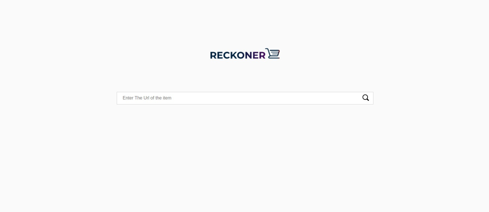
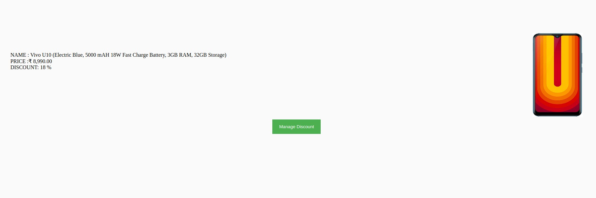
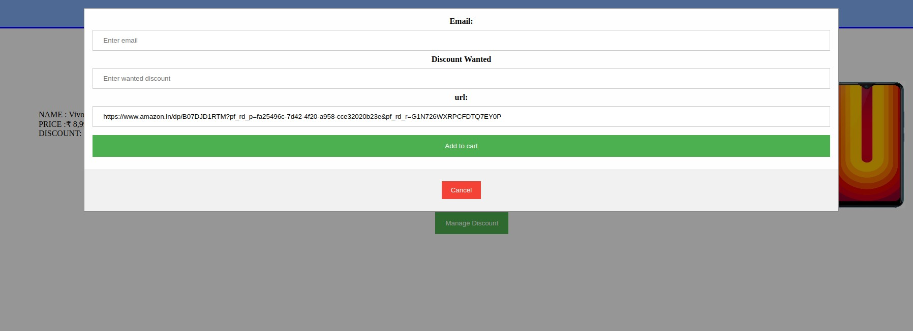

> A real time discount tracker for all amazon.in products.

> real time discount manager

## Table of Contents (Optional)

> If your `README` has a lot of info, section headers might be nice.

- [Installation](#installation)
- [Features](#features)
- [Contributing](#contributing)
- [License](#license)

## Installation

- All the `code` required to get started
- Images of what it should look like

## Features

- Real time product discount notifier for www.amazon.in.
- Notifies the intrested user when their product reaches their desired discount level.
- Fast and easy to use.

### Clone

- Clone this repo to your local machine using `https://github.com/invincibel/reckoner/` or `https://github.com/090max/Amazon-Reckoner`

### Setup

- Put the folder in /opt/lampp/htdocs.
- Make a `Reckoner` named Database in phpmyadmin. 

---

## Contributing

> To get started...

### Step 1

- **Option 1**
    - 🍴 Fork this repo!

- **Option 2**
    - 👯 Clone this repo to your local machine.

### Step 2

- **HACK AWAY!** 🔨🔨🔨

## License

- **[MIT license](http://opensource.org/licenses/mit-license.php)**
- Copyright 2015 © <a href="http://fvcproductions.com" target="_blank">FVCproductions</a>.
